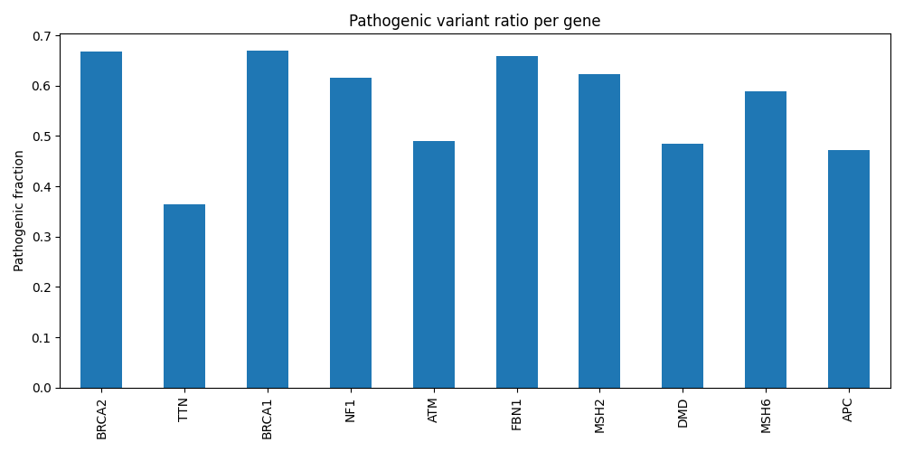
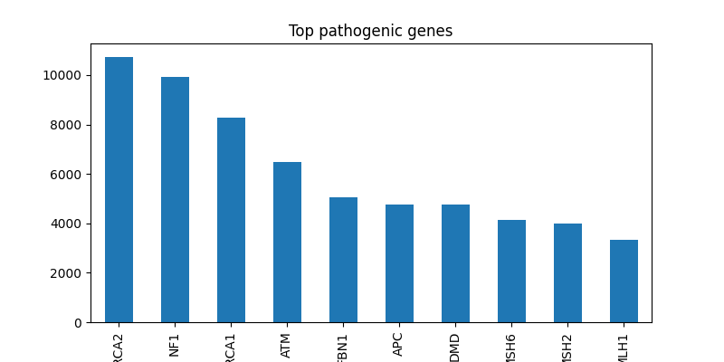

# ClinVar Pathogenicity Analysis

This project explores differences between pathogenic and benign variants in the ClinVar database and investigates whether simple gene-level features can help distinguish between them.

## Background

ClinVar is a public database that aggregates information about genomic variants and their clinical significance. Identifying genes enriched for pathogenic variants is essential for understanding disease mechanisms and prioritizing targets for further research.

## Approach

The analysis follows a simple and transparent workflow:

- loading and filtering ClinVar variant data
- separating variants into pathogenic and benign classes
- identifying the most frequently affected genes
- comparing variant distributions across classes
- visualizing results using bar plots

## Results

Certain genes (e.g. BRCA1, BRCA2, NF1) show a strong enrichment of pathogenic variants.

To better quantify this, a normalized ratio was calculated:

This highlights genes where a large proportion of reported variants are classified as pathogenic.

## Visualization

### Pathogenic variant ratio per gene

This figure shows the fraction of pathogenic variants per gene.
Higher values indicate genes where a larger proportion of reported variants are pathogenic.
This figure shows the top genes with the highest number of pathogenic variants reported in ClinVar.  
Genes such as BRCA1, BRCA2, and NF1 are strongly enriched, reflecting their well-established roles in hereditary disease.

This figure shows the proportion of pathogenic variants relative to all classified variants per gene.  
Higher values indicate genes where a larger fraction of reported variants are pathogenic.

Genes such as BRCA1, BRCA2, and NF1 show high pathogenic fractions, reflecting strong disease association, while others (e.g. APC) show a more balanced distribution.

This highlights the importance of distinguishing between absolute variant counts and relative pathogenic enrichment when interpreting gene-level data.

## Interpretation

Genes such as BRCA1 and BRCA2 are well-known cancer susceptibility genes and show a high proportion of pathogenic variants in ClinVar.

Other genes (e.g. NF1, MSH2, MLH1) are also strongly associated with inherited disease syndromes, which is reflected in their variant profiles.

However, these results should be interpreted with caution:

- ClinVar data is biased toward clinically studied genes  
- variant classifications reflect submitted evidence, not absolute biological truth  
- many diseases are influenced by multiple genes and environmental factors  

## Key Takeaway

Even a simple exploratory analysis of ClinVar data can reveal biologically meaningful patterns and demonstrate how computational methods can support genetic interpretation.

## Project Structure

## Future Work

Possible extensions include:

- incorporating variant-level features (e.g. mutation type, consequence)
- analyzing additional clinical significance categories
- exploring gene-specific mutation patterns
- applying machine learning models for variant classification