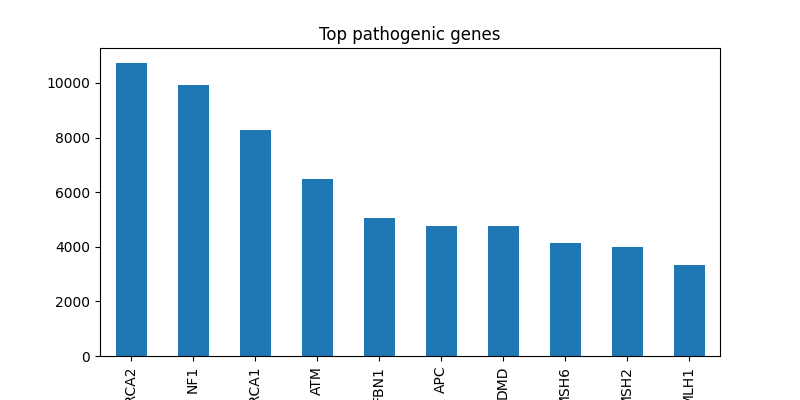
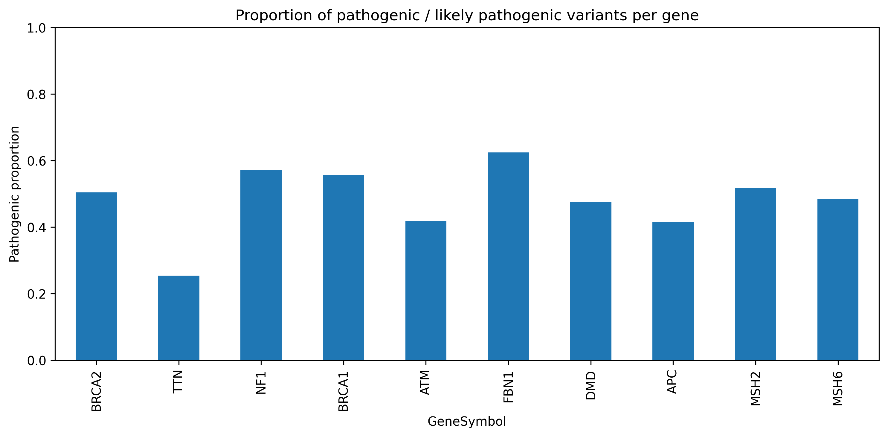

## Overview

This project analyzes ClinVar variant data to identify genes enriched for pathogenic variants.
The analysis compares both absolute variant counts and pathogenic proportions across genes.

# ClinVar Pathogenicity Analysis

This project explores differences between pathogenic and benign variants in the ClinVar database and investigates whether simple gene-level features can help distinguish between them.

## Background

ClinVar is a public database that aggregates information about genomic variants and their clinical significance. Identifying genes enriched for pathogenic variants is essential for understanding disease mechanisms and prioritizing targets for further research.

## Approach

The analysis follows a simple and transparent workflow:

- loading and filtering ClinVar variant data
- separating variants into pathogenic and benign classes
- identifying the most frequently affected genes
- comparing variant distributions across classes
- visualizing results using bar plots

## Results

Certain genes (e.g. BRCA1, BRCA2, NF1) show a strong enrichment of pathogenic variants.

To better quantify this, a normalized ratio was calculated:

This highlights genes where a large proportion of reported variants are classified as pathogenic.

## Visualization

This figure shows the genes with the highest numbers of unique pathogenic or likely pathogenic variant–gene pairs in ClinVar.

BRCA2, TTN, NF1, and BRCA1 are among the genes with the largest numbers of reported pathogenic or likely pathogenic variants.

Absolute variant counts should be distinguished from relative pathogenic enrichment, since genes with many ClinVar submissions may have high counts of both pathogenic and benign variants.

### Pathogenic variant ratio per gene

This figure shows the proportion of pathogenic or likely pathogenic variants among the pathogenic/likely pathogenic and benign/likely benign variants for each gene.

The pathogenic proportion varies considerably between genes. For example, FBN1 and NF1 show relatively high pathogenic proportions, whereas TTN has a substantially lower proportion despite having many reported pathogenic variants.

This demonstrates why absolute variant counts and relative pathogenic proportions provide complementary information.
## Interpretation

Genes such as BRCA1 and BRCA2 are well-known cancer susceptibility genes and are among the genes with large numbers of pathogenic or likely pathogenic variants in ClinVar.

Other genes in the analysis, including NF1, MSH2, and MSH6, are associated with inherited disease syndromes and show distinct pathogenic-to-benign variant profiles.

However, these results should be interpreted with caution:

- ClinVar data is biased toward clinically studied genes  
- variant classifications reflect submitted evidence, not absolute biological truth  
- many diseases are influenced by multiple genes and environmental factors  

## Key Takeaway

Even a simple exploratory analysis of ClinVar data can reveal biologically meaningful patterns and demonstrate how computational methods can support genetic interpretation.

## Project Structure

## Future Work

Possible extensions include:

- incorporating variant-level features (e.g. mutation type, consequence)
- analyzing additional clinical significance categories
- exploring gene-specific mutation patterns
- applying machine learning models for variant classification
